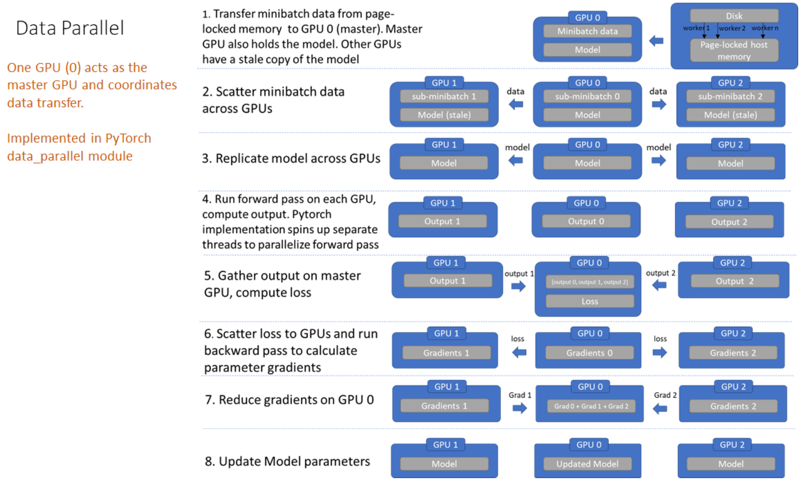

# （标准）数据并行（DP）

## 基本原理

* 每个worker持有完整的模型副本，独立处理数据批次的子集，进行前向计算、反向计算。
* master负责分发数据、模型、损失，收集各个worker上的outputs、grads
* 最终等效成B大小的batch进行训练。

## 详细过程

1. 数据和模型加载到master上
3. master分发模型到各个worker上
4. master分发数据到各个worker上
5. 各个worker上分别进行前向传播，得到各自的outputs
6. master收集素有的outputs，计算loss
7. master分发loss到各个worker上，各个worker进行反向传播，得到grads
8. master收集grads，进行聚合（平均），更新master上的模型参数
9. 重复2~7

缺点：

* 只能在单个服务器上使用（单机多卡）
* master计算和通信负载严重，出现瓶颈

参考：https://www.telesens.co/2019/04/04/distributed-data-parallel-training-using-pytorch-on-aws/
